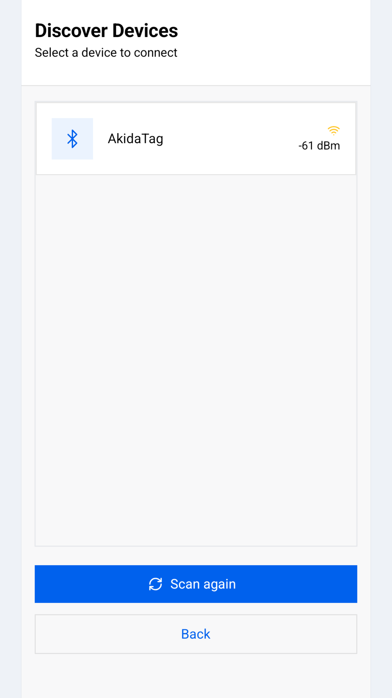
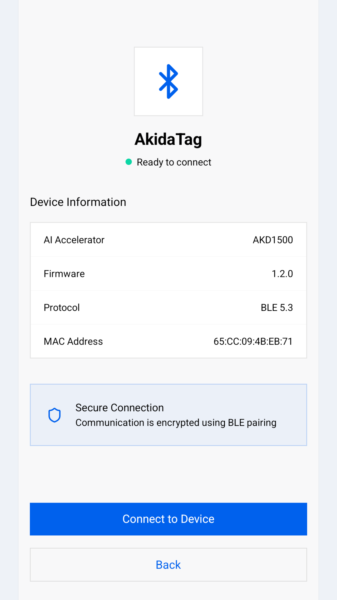

## Before you start

- The AkidaTag must be powered. The box holds the board and its enclosure
  and nothing else: no battery, no camera and no USB-C cable, so bring a
  USB-C cable to power it. While it waits for a phone its green LED blinks
  slowly; the other patterns are listed under
  [What the AkidaTag LEDs mean](/BrainChip-Connect/user-guide/troubleshooting.html#what-the-akidatag-leds-mean).
- Bluetooth must be on, on the phone.

## Discover Devices

**Discover Devices** starts a scan as soon as it opens and scans for ten
seconds. Every board in range appears as a card with its name and its signal
strength in dBm: the closer to zero, the stronger. If nothing is found the
list reads **No devices found**. Move closer to the board, check that it is
powered, and tap **Scan again**.

The app recognises a board by the AKD1500 accelerator it announces in its
Bluetooth advertisement, not by its name. That is why the list shows only
BrainChip boards, whatever they are called. An AkidaTag advertises as
`AkidaTag` and a Nicla Vision with a BrainBoard1500 as `BrainBoard1500`.

## Device Preview

Tap a card to open **Device Preview**. Nothing is connected yet: the table is
read from the advertisement.

| Row | What it shows |
| --- | --- |
| AI Accelerator | The BrainChip accelerator on the board, `AKD1500`. |
| Firmware | The firmware version the board is running, as major.minor.revision, for example `1.2.0`. This is where to check the version before and after a [firmware update](/BrainChip-Connect/user-guide/firmware-update.html). |
| Protocol | The Bluetooth version the board announces, `BLE 5.3`. |
| MAC Address | The address the phone currently sees the board under. An AkidaTag uses a private address that changes about every fifteen minutes, so this row does not identify a board for long. |

Tap **Connect to Device**.

## Connecting

**Connecting** shows a progress bar through *Establishing connection* and
*Syncing configuration*. The app connects, asks the board for its details,
its battery level and its list of applications, and moves on to **Select the
Application**, the Home tab. No pairing code is asked for.

If the board cannot be reached within twenty seconds the app shows
**Connection Failed**. Tap **OK** to return to the device list and try again.

## Once connected

From here on every screen has the BrainChip header at the top, with the
board's name at the right, and the tab bar at the bottom: **Home**,
**Notifications**, **Settings** and **Profile**. Tapping the logo returns to
Home. On an AkidaTag the green LED stays on for as long as a phone is
connected.

## Disconnecting

Open **Profile**, tap **Unpair Device**, confirm with **Unpair** and then
**Disconnect**. The app closes the Bluetooth link, shows **Disconnected** and
returns to **Discover Devices**. The app keeps no record of the board, so
there is nothing to forget: the next connection is made the same way as the
first.

The app does not reconnect on its own. If the link drops, because the board
restarted or went out of range, the app shows **Device Disconnected** with a
**Reconnect** button, which returns to **Discover Devices** and starts a new
scan.
