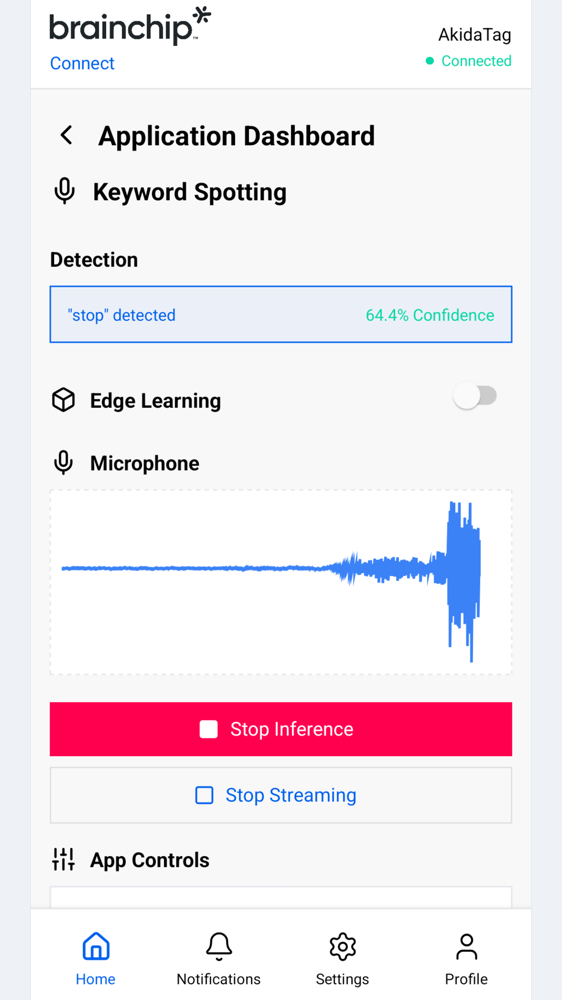

A demo is an application the board reports on the Home tab. **Run
Application** starts it, and **Application Dashboard** on the active card
opens the screen that shows what it is doing.

## Keyword Spotting on the AkidaTag

The AkidaTag listens through its microphone for ten keywords: `down`, `go`,
`left`, `no`, `off`, `on`, `right`, `stop`, `up` and `yes`. It runs the model
on its AKD1500 from power-up whenever a model is stored, whether or not a
phone is connected, and flashes its red LED for about half a second on every
keyword it hears.

The AkidaTag's microphone is quieter than most. Say the word clearly and
close to the board; the result depends on the room.

### The dashboard

From top to bottom:

- **Detection** shows the last keyword heard, in quotes, the board's
  confidence as a percentage and how long ago it arrived. Before the first
  one it reads **No keyword detected yet**. The board reports a keyword when
  it hears one and nothing in between, so the banner is the latest report,
  and the time under it says how old that report is.
- **Edge Learning** teaches the board new keywords. See below.
- **Microphone** draws what the board hears, while streaming.
- **Stop Inference** and **Start Inference** stop and start the detector on
  the board. Stopping here also marks the application inactive on the Home
  tab. A stopped detector stays stopped, even after you disconnect, until it
  is started again or the board is restarted.
- **Start Streaming** and **Stop Streaming** turn the microphone waveform on
  and off. Keywords are reported whether or not you are streaming.
- **App Controls** are the detector's tuning parameters, read from the board
  when the dashboard opens.

### App Controls

| Parameter | Default | Allowed |
| --- | --- | --- |
| RMS threshold | 550 | 0 or more |
| Debounce time (ms) | 300 | 0 or more |
| Smoothing alpha | 0.70 | 0 to 1 |
| Score threshold | 0.50 | 0 to 1 |
| Chiming threshold | 3 | 1 or more |
| Speech timeout (ms) | 1300 | 0 or more |

The detector only listens for speech once the microphone signal is above the
RMS threshold, smooths each new score with the previous ones, and reports a
keyword once its smoothed score has reached the score threshold for the
chiming threshold's number of consecutive results. After it reports a
keyword, the board ignores the microphone for the debounce time, so one word
cannot be reported twice. Once the signal has crossed the RMS threshold, the
speech timeout is how long it may stay below the threshold before the board
decides no keyword was said, discards what it had heard so far and goes back
to waiting.

Edit a value and tap **Apply**; the board confirms each change, and any it
refuses is listed with the reason. **Reset** restores the defaults on the
board. The board keeps the values across restarts and returns them to the
defaults when its firmware version changes.

### Edge Learning

An AkidaTag can learn up to three new keywords on the device itself, using
the AKD1500's on-chip learning. It needs a model built for edge learning, the
`kws_edge_learning` package. With any other model the board ignores the
learning commands.

The switch and buttons step through the board's learning modes:

1. Switch **Edge Learning** on. The board pauses keyword detection and enters
   class selection.
2. **Next Class** cycles through the three learnable classes, which the board
   reports as `cls_12`, `cls_13` and `cls_14`.
3. **Start Learning**. After a second the board's red LED comes on: say the
   new keyword. Repeat until the board has heard it five times, the LED
   coming on for each. After the fifth the board saves the class, the app
   shows **Completed**, and the board is back in class selection. Switch
   **Edge Learning** off to resume detection.
4. **Delete Class** returns all learned classes to the base model. Restart
   the board afterwards.

Each control changes only once the board has confirmed the command. If the
board does not answer, the app says so and leaves the switch as it was.
Learned keywords survive a restart and a firmware update.

## Nicla Vision with BrainBoard1500

An Arduino Nicla Vision carrying a BrainBoard1500 can run BrainChip's
Bluetooth demo sketch, `bb15_nicla_vision_connect` from the
[brainboard1500_arduino_library](https://github.com/Brainchip-Inc/brainboard1500_arduino_library)
repository. It advertises as `BrainBoard1500` and works with the same app.
These are the differences from the AkidaTag.

- **Two demos, both sent from the app.** No model is built into the sketch.
  Send the keyword spotting model and the human detection model with
  [Model Update](/BrainChip-Connect/user-guide/model-update.html); each one
  that arrives adds its card to the Home tab. The board decides which demo a
  model belongs to by its input shape: `[49, 10, 1]` is Keyword Spotting and
  `[96, 96, 3]` is Vision Human Detection. A model survives a power cycle, so
  it only has to be sent once. A model must be built for the Akida engine the
  sketch carries, 2.5.0; an AkidaTag model will not load on this board.
- **Starting an application loads its model** into the accelerator, which is
  why the card reads **Starting** for about two seconds. Only one demo runs
  at a time.
- **Vision Human Detection** scores a 96 by 96 crop of the camera about
  fifteen times a second and reports **Person detected** once when someone
  arrives. Nothing is sent when they leave, so the banner shows how long ago
  the last person was seen and the board's LED is the live indicator. The
  dashboard's **Camera** section shows what the model sees, in grayscale,
  while streaming, at about two frames a second. Frames are skipped rather
  than queued so that detection keeps its pace.
- **Not on this board:** Edge Learning and Firmware Update, because the
  sketch offers neither. Everything else works: battery, the application
  list, the microphone waveform and App Controls.

:::note[Screenshot to come]
TBD: screenshot of the Vision Human Detection dashboard with the camera
preview.
:::
