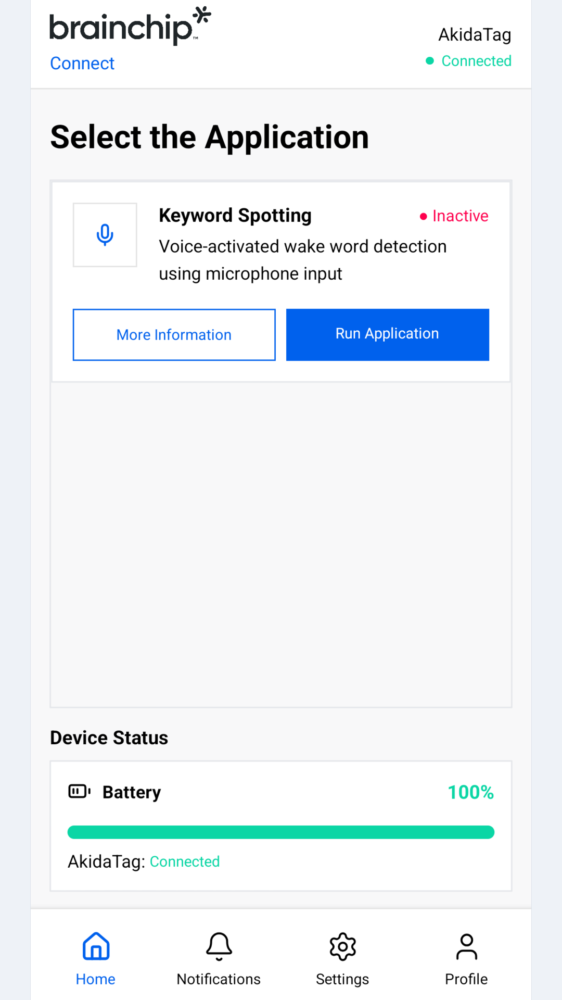
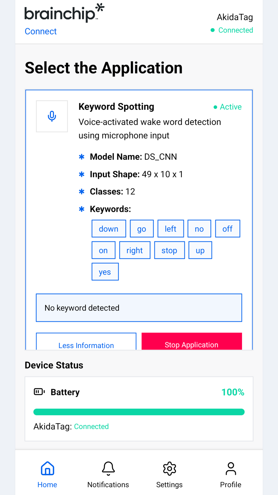
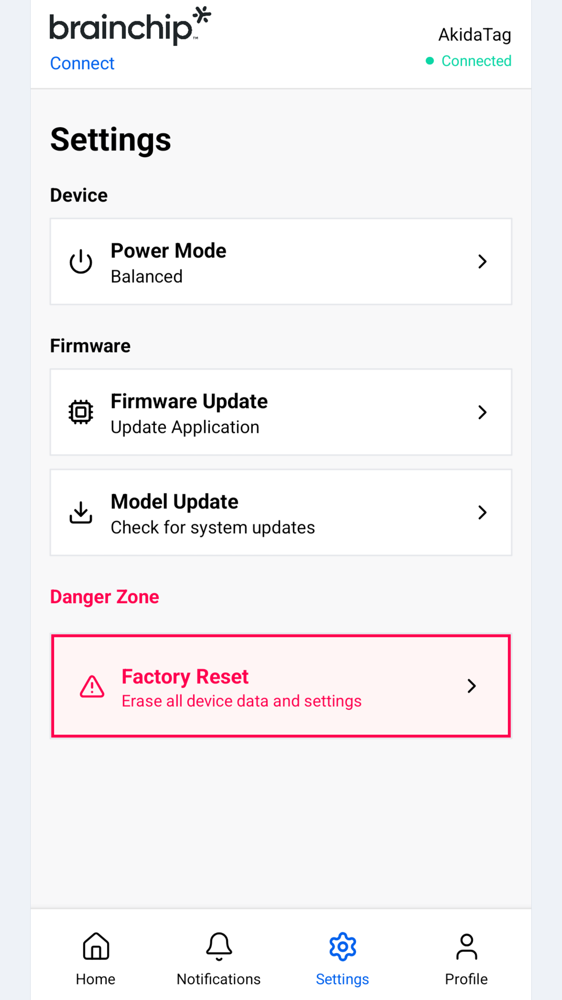

Once a board is connected the app has four tabs. **Home** is where the
board's applications are, and the other three are described below in the
order they sit in the tab bar.

## Home: Select the Application

One card per application the board reports. An AkidaTag reports one,
**Keyword Spotting**. A Nicla Vision with a BrainBoard1500 reports one card
for each model that has been sent to it.

On each card:

- **More Information** asks the board for the model's name, its input shape,
  how many classes it has and the keywords it knows, and shows them under the
  card.
- **Run Application** starts the demo on the board. The card reads
  **Starting** until the board confirms, then **Active**. On a BrainBoard1500
  the start loads the model into the accelerator first, which takes about two
  seconds.
- **Stop Application** stops it.
- The active card also carries the **Detection** banner and the
  **Application Dashboard** button, which opens the demo's own screen. The
  [demos chapter](/BrainChip-Connect/user-guide/demos.html) covers both.

Right after connecting, every card reads **Inactive**. An AkidaTag runs
keyword spotting on its own from power-up, and its red LED flashes on each
keyword it hears, but it reports keywords to the phone only once you have
tapped **Run Application**, and that is when the app shows the card as
active.

**Device Status**, under the cards, shows the battery level the board
reports, coloured red at 20% or below and amber at 50% or below, with a
charging, warning or fault label beside it when the board reports one.

## Notifications

Every detection the app has received since it was opened, newest first and
grouped by day: which application reported it, the label, the confidence and
how long ago it arrived. **See more details** is not implemented in this
version and says so when tapped.

These entries live inside the app. It does not post system notifications.

## Settings

- **Power Mode** opens a chooser with **Performance**, **Balanced** and
  **Power Save**. In this version the choice is not sent to the board; that
  is planned for a later version.
- **Firmware Update** sends new firmware to the board. See
  [Update the AkidaTag firmware](/BrainChip-Connect/user-guide/firmware-update.html).
- **Model Update** sends a model package to the board. See
  [Load a model](/BrainChip-Connect/user-guide/model-update.html).
- **Factory Reset**, after a confirmation, sends the board a restart command.
  An AkidaTag restarts and keeps its model, its learned keywords and its
  keyword spotting settings. The app then shows **Device Restarting**; tap
  **Reconnect** to return to the device list.

## Profile

- **About** shows the app's version, a summary of the board hardware and a
  link to brainchip.com.
- **Privacy & Data** and **Terms & Conditions** show the two documents
  accepted on first run.
- **Connected Device** names the board; tapping it opens Device Information.
- **Unpair Device** disconnects, as described under
  [Disconnecting](/BrainChip-Connect/user-guide/connect.html#disconnecting).

## Device Information

Tap the board's name in the header on Home, Settings or Profile. The sheet
shows the name and a hardware summary: the nRF5340 microcontroller, the
AKD1500 AI processor and Bluetooth 5.3 LE. That summary describes the
AkidaTag and reads the same for every board. The name can be edited in the
sheet, but in this version the change is not sent to the board; renaming a
board from the app is planned for a later version.

